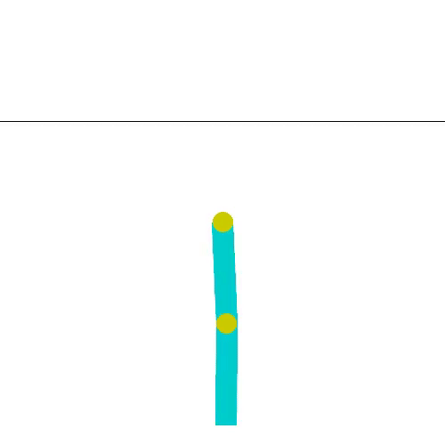
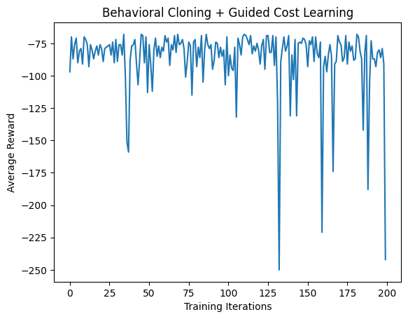
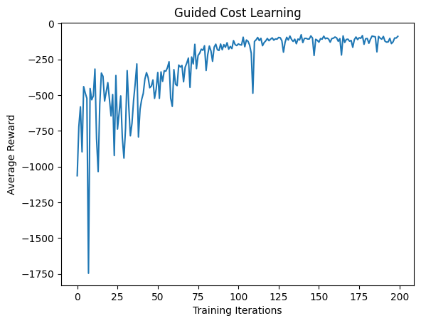

# Predicative ML Project 2023

## Generate Expert Data Using PPO
- Run `python main.py` to train the PPO algorithm on the acrobot system and the train model will be named `ppo_actor.pth`
- Run `python generate_data.py` to generate 100 expert demonstrations from the trained PPO algorithm

## RUN Guided Cost Learning
- Run `python main.py` to train Guided Cost Learning algorithm

## Result

